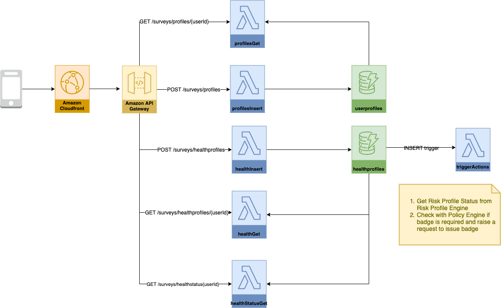

# Design

Edit diagram by importing diagram to  https://app.diagrams.net/



## Table userprofiles

|Name|Values|Description|
|--|--|--|
|userId|Slug ID| **Primary Key**|
|email|E-Mail|Global Secondary Index|
|surveyId|Survey ID from URL||
|passLocation|Location||
|userType| "employee" or "visitor"||
|hashedToken| hash of token||
|requestId|Badge Request ID||
|createdDate|Created Date Time||
|updatedDate|Updated Date Time||

## Table healthprofiles

|Name|Values|Description|
|--|--|--|
|userId|Slug ID| **Primary Key**|
|healthProfileId|Slug ID||
|healthProfile|_Region Specific_: health parameters such as temperature, symptoms, overall health status||
|riskScore|Green, Amber, Red||
|createdDate|Created Date Time|**Sort Key**|
|updatedDate|Updated Date Time||

## Technology

| Concern | Technology|Description|
|--|--|--|
|Web UI|React, CloudFront|Progressive Web App|
|API|AWS Gateway|Open API Spec|
|Business Logic|NodeJS|AWS Lambda|
|Coded Deployment|AWS Code Pipeline, AWS Code Build, AWS Cloud Formation |

## UI Screens

* Employee Join Survey: /surveys/employeeJoin/{surveyId}#SecretToken
* Visitor Join Survey: /surveys/visitorJoin/${location}/{surveyId}#SecretToken

## Sample requests to Rules Engine

### Rule #1: Check Badge Issuance

#### Input

```bash
{
    "region" : {
        "country": "Singapore",
        "consecutiveHealthReportDays": 5
    },
    "healthRiskIndex": [
        {
            "date": "2020/04/01",
            "rsi": "green"
        },
        {
            "date": "2020/04/03",
            "rsi": "green"
        },
        {
            "date": "2020/04/05",
            "rsi": "green"
        }
    ]
    "badgeStatus" : no
}
```

### Output

Zero or more actions to be taken:

```json
{
    "action": "bIssueBadge"
}
```

Valid actions:

* issueBadge
* revokeBadge
* noAction

'actions' attribute may be empty if no action is required to be taken.  This will occur when minimum number of health status reporting days is not met

## API

### POST /surveys/profiles

#### Sample Request to add user profile (one time capture)

```json
{
    "name": "John Doe",
    "emailId": "jdoe@example.com",
    "userProfile": {
        ...
    }
}
```

#### Sample Response after adding user profile (one time capture)

```json
{
    "userId": "slugId",
    "name": "John Doe",
    "emailId": "jdoe@example.com",
    "userProfile": {
        ...
    }
}
```

### POST /surveys/healthprofiles

Add health profile

#### Sample Request to add health profile

```json
{
    "userId": "slugId",
    "healthProfile": {
        ...
    }
}
```

### Sample Response after adding health profile

```json
{
    "userId": "slugId",
    "healthProfile": {
        ...
    }
}
```

### Serverless Components

#### TriggerActions

```bash
# 1. Get Risk Score
riskScore = GET /RiskProfileEngine/GetRiskScore

# 2. Check if badge needs to be issued
nDaysHealth4BadgeCheck = (GET /forms/{surveyId}/form).mandatedDays
country = (GET /forms/{surveyId}/form).country
# 2.1 Get Risk Score of health profiles for the last N days

# Add index for createDate if required
SELECT healthProfileId, createDate, riskScore INTO riskScoreArray
FROM hswrHealthProfiles
WHERE   userId = :userId AND
        createDate BETWEEN TODAY() AND (TODAY() - nDaysHealth4BadgeCheck) + 1)

# if current record included in above SELECT
riskScoreArray.find(healthProfileId).riskScore = riskScore

# if current record missing in above SELECT
# riskScoreArray.append({createDate: TODAY(), riskScore: hswrHealthProfile.riskScore})

# 3. Issue badge if no risk for last n days
#    Revoke badge if risk araised
bBadgeIssued = hswrUserProfile(userId).badgeIssued # comes from hswrUserProfile table
requestId = hswrUserProfile.requestId ## comes from hswrUserProfile table

if (length(riskScoreArray) >= nDaysHealth4BadgeCheck) then
    bNoEvidenceOfRisk = (riskScoreArray has all 'Low') ? true : false
    bEvidenceOfRisk = !bNoEvidenceOfRisk
    bNoDaysMissed = noDatesMissed(riskScoreArray, TODAY(), TODAY() - nDaysHealth4BadgeCheck) ? true : false
    bDaysMissed = !bNoDaysMissed
    if bNoEvidenceOfRisk AND bNoDaysMissed then
        bIssueBadgeIfNotIssued = true;
    fi
    revokeReason = ""
    if bDaysMissed then
        revokeReason = "<One of the recent days you haven't reported health profile>"
        bRevokeBadgeIfIssued = true;
    fi
    if bEvidenceOfRisk then
        revokeReason = revokeReason + "<Evidence of Risk>"
        bRevokeBadgeIfIssued = true;
    fi
    if bBadgeIssued == false and bIssueBadgeIfNotIssued then
        bIssueBadge = true
    fi
    if bBadgeIssued AND bRevokeBadgeIfIssued then
        bRevokeBadge = true
    fi

    if (bIssueBadge) then
        response = POST /raa/raaRequests
        bBadgeIssued = true
    else if (bRevokeBadge) then
        response = POST /raaRequests/revoke( hswrUserProfile.requestId, revokeReason )
        requestId = response.requestId
        bBadgeIssued = false
    fi

    UPDATE hswrHealthProfile WITH
        hswrHealthProfile.riskScore = riskScore

    UPDATE hswrUserProfiles WITH
        hswrUserProfile.badgeIssued = bBadgeIssued
        hswrUserProfile.requestId = requestId
fi

function noDatesMissed(riskScoreArray, fromDate, toDate) { return true; // TBD }
```

#### Trigger Action (using rules engine)

```bash
# 1. Get Risk Score
riskScore = GET /RiskProfileEngine/GetRiskScore

# 2. Check if badge needs to be issued
nDaysHealth4BadgeCheck = (GET /forms/{surveyId}/form).mandatedDays
country = (GET /forms/{surveyId}/form).country
# 2.1 Get Risk Score of health profiles for the last N days

# Add index for createDate if required
SELECT healthProfileId, createDate, riskScore INTO riskScoreArray
FROM hswrHealthProfiles
WHERE   userId = :userId AND
        createDate BETWEEN TODAY() AND (TODAY() - nDaysHealth4BadgeCheck) + 1)

# if current record included in above SELECT
riskScoreArray.find(healthProfileId).riskScore = riskScore

# if current record missing in above SELECT
# riskScoreArray.append({createDate: TODAY(), riskScore: hswrHealthProfile.riskScore})

# 3. Check If badge needs to be issued or revoked
bBadgeIssued = hswrUserProfile(userId).badgeIssued # comes from hswrUserProfile table
requestId = hswrUserProfile.requestId ## comes from hswrUserProfile table

peRequest = {
    "region" : {
        "country": country,
        "consecutiveHealthReportDays": nDaysHealth4BadgeCheck
    },
    "healthRiskIndex": riskScoreArray
    "badgeStatus" : badgeIssued
}

response = POST /PolicyEngine/ExecRule (peRequest)

if response["issueBadge"] {
    bIssueBadge = true
} else if (response["revokeBadge"]) {
    bRevokeBadge = true
}

if (bIssueBadge) then
    response = POST /raa/raaRequests
    bBadgeIssued = true
else if (bRevokeBadge) then
    response = POST /raaRequests/revoke( hswrUserProfile.requestId, revokeReason )
    requestId = response.requestId
    bBadgeIssued = false
fi

UPDATE hswrHealthProfile WITH
    hswrHealthProfile.riskScore = riskScore

UPDATE hswrUserProfiles WITH
    hswrUserProfile.badgeIssued = bBadgeIssued
    hswrUserProfile.requestId = requestId
```

#### profileInsert

```bash
# 1. Get survey Id from URL https://${hostName}/surveys/SURVEY#slugID 
    surveyId = request.urlParameter.surveyId
    email = request.email
# 2. check if user exists 
    SELECT userId, createdDate INTO userProfileArray
    FROM hwsrUSerProfile
    WHERE   surveyId = :surveyId AND
            email = :email

    surveyLink =  "https://${hostName}/surveys/" + userProfileArray.userId
    if (userProfileArray.length() = 0 ) # Joining the survey for the first time
        # Store whether visitor or employee
        response = GET /forms/{surveyId}/form
        userType = response.userType
        INSERT INTO userProfiles VALUES surveyId, email, userType

        E-Mail Notification(`You now have been enrolled into Project Soteria Survey. The unique link to your survey is here ${surveyLink}.  Bookmark this link for daily reporting.  Please do not share this unique link with others.`)
    else # user exists
        E-Mail Notification( `You have already enrolled into Project Soteria Survey.  The survey which can be accessed here ${surveyLink}.  Bookmark this link for daily reporting.  Please do not share this unique link with others.`)
    fi
    return OK
```
